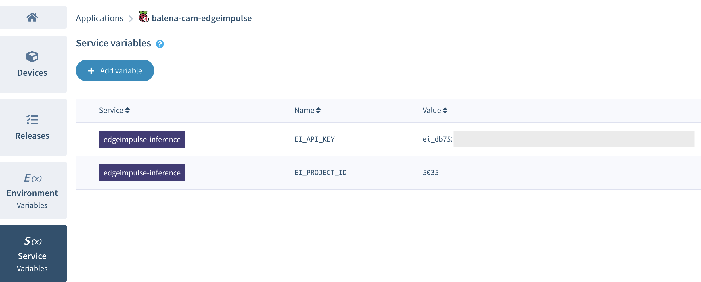
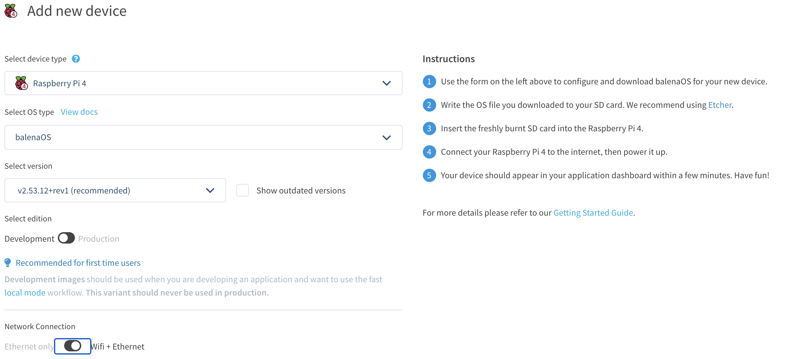
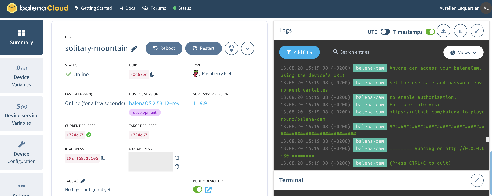

# Penumonia Detection using EdgeML
Pneumonia Detection project made using Edge Impulse, Himax, Raspberry Pi and balenaCloud.

## To deploy on Raspberry Pi using balenaCloud 
Click on the following link to deploy the application to your Balena account:

Once your application has been deployed, click on *Service variable* and add the two following variables to the *edgeimpulse-inference* service:
* EI_API_KEY
* EI_PROJECT_ID

You can get the Project ID value in your Edge Impulse's project dashboard. The API Key is in the *Keys* subsection of the dashboard. Make sure to copy the whole API Key value (68 characters long).

Finally select the *Devices* section and add your device. Select the *Development* version if you wish to run local tests easily. Don't forget to fill up your wifi network credentials if needed:

Follow the instructions to copy the Balena OS to the SD card of your device.
Turn on the Raspberry and your device should appear in the Balena dashboard and reboot to load containers. You should see containers' logs as below:

## Testing our classifier

Open your web browser and enter your device's local IP. You can also enable public URL as shown in the screenshot above.

The camera feed should be displayed on the webpage. If you notice slow framerate, probably your web browser doesn't support WebRTC and your client has switched to MJPEG. You can check next section to debug WebRTC.

Try to move different objects in front of the camera and see how well the classifier works! Predictions are displayed for all labels with values between 0 and 1, 1 being perfect prediction

## To deploy on Himax WE-1 Dev board using Edge Impulse CLI
First download the [himax_library_package](https://github.com/arijitdas123student/pneumonia-detection-edgeml/tree/main/himax_library) 

Then extract the .zip file and click on any of the flashable binaries as per your OS (supports Mac, Linux and Windows).

Then open Terminal/Command Prompt and type `edge-impulse-run-impulse` and wait for a couple of seconds for the CLI to connect with the board via serial.

The move the board to any X-Ray or download our dataset images from [here](https://www.kaggle.com/paultimothymooney/chest-xray-pneumonia) and that's it you're done! :)

## Congratulations!
You're now running an ML model which can classify Pnuemonia under 1 miliwatt. :D
